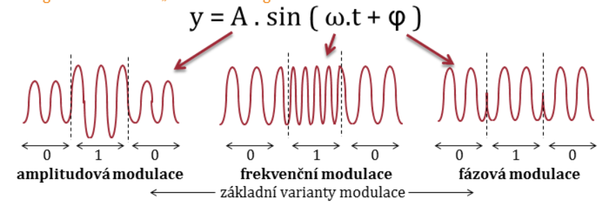

# Základy datových komunikací
- přenosové cesty, které přenáší signál
- negativně ovliněno
    - útlum
    - zkreslení
    - přeslech
    - rušení
- každý kabel vyzařuje
    - metalický
    - optický
- **analogový**
- **digitální**
- televize
    - analog (1 frekvence = 1 kanál)
    - digitální (1 frekvence = 4-6 kanálů)
- **modulovaný přenos** (sinusoida, digitální)
- **nemodulovaný přenos** (0 a 1, analog.)

